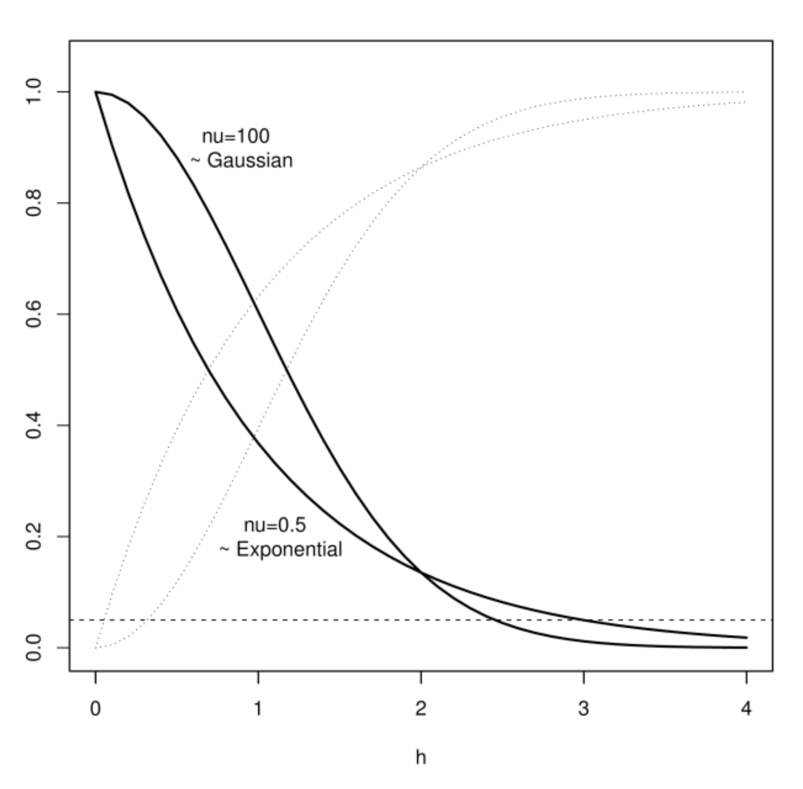

1 Challenger Drive, Dartmouth, Nova Scotia, Canada

Version date: 30/08/2019

# Introduction

Ecological and biological processes demonstrate variability in space and
in time. Characterizing this variability is necessary to understand the
generative processes. Sampling design tries to approach such issues by
trying to balance information obtained vs costs of sampling. Strategies
can range from completely random sampling in the absence of additional
information, to some form of stratified random that choose samples from
strata constrained by factors believed to be pertinent or informative or
even blocked designs that attempt to abstract away such unmeasured
factors as background variability. A common one is of course areal
stratification based upon some prior knowledge that is known or believed
to be informative (e.g., depth, temperature or some oceanic feature),
such that the variability within strata will be smaller than that
between strata. The lower the variability within strata (relative to
between-strata variability), the better the stratification of spatial
areas (design) has captured local homogeneities in the process of
interest (e.g., abundance of some organism); that is, each sample is
thought to be more representative of the stratum that it represents.

The problem of course is that the size of these strata can shrink to
unmanageable numbers as the number of informative factors increase and
the kinds of processes also increase. Further, the locations of such
strata can shift if they are based upon features that are not
geographically fixed, such as with temperature, oxygen levels, abundance
of prey or predators, light levels, etc. The fixed area approach,
therefore, crudely adjusts for the influence of these extraneous dynamic
factors by representing them by crude weights such that they can,
thereafter, be ignored. These dynamic factors, are however, generally
informative and ignoring them for the sake of simplicity by factoring
them out can lead to bias and erroneous conclusions about the focal
process(es) of interest.

There exist two main approaches attempting to incorporate such
additional spatial information: (1) a spatially continuous process and
(2) spatially aggregated areal units. Both approaches decompose the
spatial patterns into those that are associated with 1) informative
factors; 2) structured spatial autocorrelation patterns; and 3)
completely nonspatial, unstructured errors. In the following, we will
summarize the general background to the field, and focus upon the
spatially continuous case, following closely Banerjee et al.'s (2004)
exposition. To assist in the context of stock assessment and general
spatial and spatiotemporal modeling of potentially large areas, some of
these methods have been formulated in an R-package, **stmv**
(https://github.com/jae0/stmv). This document will also serve to
document these methods. The spatially aggregated case is treated in a
separate document
(https://github.com/jae0/carstm/blob/master/docs/carstm_methods.pdf).

# Continuous representation

## Spatial autocorrelation

To be precise, we focus upon any spatially referenced observation
$Y_{s}$ at locations $s$, measured in a coordinate space whose domain
$D$ has dimensionality $d$ such that
$\{\mathbf{\text{s}}\in D\in\Re^{d}\}$. We focus upon the simple case of
$d=2$ spatial dimensions, such that for example,
$s=(\text{northing, easting})$. The observations $Y_{s}$ are assumed to
be realizations of a **spatial stochastic process**, $y$, that is some
latent unobservable but real, stochastic, generative **function** (i.e.,
a spatial random field) such that $y_{s}\rightarrow Y_{s}$ at
{$k=1,\dots,K$} spatial locations. The manner in which the variability
of $y_{s}$ changes as a function of distance,
$h=\parallel s-s'\parallel$, is known as the spatial autocorrelation
function $\rho(h)$. The $\parallel\cdot\parallel$ indicates a spatial
norm which in $d=2$ spatial dimensions is simply the Euclidean distance,
$h=(\Delta\text{northing}^{2}+\Delta\text{easting}^{2})^{1/2}$.

The spatial model is expressed as a regression model of a stochastic
process (Banerjee et al. 2004):

$$g(Y_{s})=\boldsymbol{x}_{s}^{T}\boldsymbol{\boldsymbol{\beta}}+\omega_{s}+\varepsilon_{s},\label{eq:basic_spatial_model}$$

where, the observations $Y_{s}$ are realizations of some mean process
$\boldsymbol{x}_{s}^{T}\boldsymbol{\boldsymbol{\beta}}$ (sometimes
referred to as external drift in the kriging literature), and a residual
error process $(\omega_{s}+\varepsilon_{s})$, operating potentially
under the context of Generalized Linear Models via the link function
$g(\cdot)$. The $x_{s}$ are spatially referenced predictors with
associated parameters **$\boldsymbol{\beta}$**. The residual error
process is decomposed into spatially structured $\omega_{s}$ and
spatially unstructured $\varepsilon_{s}$ components, both with mean of
zero. The latter is also commonly called the "nugget" error in
geostatistics and used to represent measurement and/or microscale
variability/processes; it is usually assumed to have a Normal
distribution and standard deviation $\sigma_{\varepsilon}$. The spatial
error is assumed to follow a **Gaussian process** with mean 0 and a
spatial covariance function $C(s,s';\theta)$ that describes form of the
variance of the process as a function of distance between data,
controlled by the parameters $\theta$ and spatially structured standard
deviation $\sigma_{\omega}$ (see below). The full model specification
is, therefore:

$$\begin{matrix}g(Y_{s}) & = & \boldsymbol{x}_{s}^{T}\boldsymbol{\boldsymbol{\beta}}+\omega_{s}+\varepsilon_{s},\\
\varepsilon_{s} & \sim & \text{N}(0,\sigma_{\varepsilon}^{2}),\\
\omega_{s} & \sim & \text{GP}(\boldsymbol{0},C(s,s';\theta)).
\end{matrix}$$

The above is equivalent to assuming a Multivariate Normal likelihood for
the observations $\mathbf{Y}=(Y_{s_{1}},\ldots,Y_{s_{K}})^{T}$, with
mean
$\boldsymbol{\mu}=g(\mathbf{Y})=\left[x_{\text{s}_{i}}^{T}\right]_{i=1}^{K}\boldsymbol{\beta}$
and a covariance matrix
$\boldsymbol{\mathbf{\Sigma}}=\left[C(\text{s}_{i},\text{s}_{j};\theta)\right]_{i,j=1}^{K}+\tau^{2}I_{K}$,
such that
$\mathbf{Y}\sim\text{MVN}(\boldsymbol{\mu},\boldsymbol{\Sigma})$; with
$I_{K}$ an identity matrix of size $K$. It is also computationally more
efficient as fewer likelihood evaluations are conducted, and faster
sparse-matrix implementations of the Multivariate Normal exist.

The spatial covariance function $C(h)=C(s,s';\theta)$ expresses the
tendency of observations closer together to be more similar to each
other than those further away. Commonly used forms include:

$$\begin{matrix}C(h)_{\text{Spherical}} & = & \left\{ \begin{matrix}\sigma_{s}^{2}(1-\frac{3}{2}h/\phi+\frac{1}{2}(h/\phi)^{3}); & 0<h<=\phi\\
0; & h>\phi,
\end{matrix}\right.\\
C(h)_{\text{Exponential}} & = & \sigma_{s}^{2}e^{-h/\phi},\\
C(h)_{\text{Gaussian}} & = & \sigma_{s}^{2}e^{-(h/\phi)^{2}},\\
C(h)_{\text{Powered exponential}} & = & \sigma_{s}^{2}e^{-|h/\phi|^{p}},\\
C(h)_{\text{Matérn}} & = & \sigma_{s}^{2}\frac{1}{2^{\nu-1}\Gamma(\nu)}(\sqrt{2\nu}h/\phi)^{\nu}\ K_{\nu}(\sqrt{2\nu}h/\phi).
\end{matrix}\label{eq:covar_funcs}$$

At zero distance,
$C(0)=\text{Cov}(Y_{s},Y_{s})=\text{Var}(Y_{s})=\sigma_{\varepsilon}^{2}+\sigma_{s}^{2}$
(*i.e.*, global spatial variance), where $\sigma_{\varepsilon}$ is the
nonspatial, unstructured error,$\sigma_{s}$ is the spatially structured
error, and $\theta=\{\phi,\nu,p,\ldots\}$ are function-specific
parameters including $\phi$ the *range* parameter. $\Gamma(\cdot)$ is
the Gamma function and $K_{\nu}(\cdot)$ is the Bessel function of the
second kind with smoothness $\nu$. The Matérn covariance function is
frequently used in the more recent literature as the shape of this
function is flexible and known to be connected to a Gaussian spatial
random process
(Figure[\[fig:autocorrelation\]](#fig:autocorrelation){reference-type="ref"
reference="fig:autocorrelation"}).

[]{#fig:autocorrelation
label="fig:autocorrelation"}

Figure[\[fig:autocorrelation\]](#fig:autocorrelation){reference-type="ref"
reference="fig:autocorrelation"}: Matérn autocorrelation function,
$\rho(h)=C(h)/C(0)$, the covariance function $C(h)$ scaled by the total
variance $C(0)$, for two values of $\nu$ (dark lines). As $\nu$
increases $(\nu=100)$, it approaches the Gaussian curve (upper dark
curve on the left side) while at smaller values $(\nu=0.5)$ the curve is
exponential (lower dark curve on the left side). This flexibility has
made it a popular choice in geostatistics. The associated semivariograms
(scaled to unit variance) $\gamma(h)$ are shown in light stippled lines.
Spatial scale is defined heuristically as the distance$h$ at which the
autocorrelation falls to 0.1 (dashed horizontal line) -- in this example
between 2.5 and 3 distance units, depending upon value of$\nu$. The
semivariance (also called semivariogram), $\gamma(h)$, is more commonly
used in the kriging literature, and is simply the covariance function
$C(h)$ reflected on the horizontal axis of the global variance $C(0)$
such that
$\gamma(h)=C(0)-C(h)=\frac{1}{2}\ \text{Var}[Y_{s}-Y_{s}']=\sigma_{\omega}^{2}[1-\rho(h)]$.

::: list
:::

Defining the spatial scale of observations is imperative for the
development of any ecological assessment or monitoring. The **spatial
autocorrelation function** is defined as the covariance function scaled
by the global variance: $\rho(h)=C(h)/C(0)$. Heuristically, the
**spatial autocorrelation scale** is defined as the distance at which
the spatial autocorrelation decreases asymptotically to some low level.
In this document, we use $\rho(x)\rightarrow0.1$, which may be called
the practical spatial range where spatial autocorrelation approaches
$0.1$. This spatial scale is informative. When the practical spatial
range is small, this means short-range processes dominate (relative to
the scale of the whole domain). Thus, monitoring these processes can be
meaningful and fruitful in discriminating what is structuring an area of
interest. Examples of such processes might include spatial variability
in the abundance of less mobile, weakly dispersing species living in low
currents conditions that create greater spatial heterogeneity. If,
however, long-ranging processes dominate, there is a lower likelihood
that monitoring such processes will provide insights to the internal
structure of the area of interest. Examples of the latter might include
higher mobility species or or organisms that live in high dispersal
processes/currents that cause stronger spatial connectivity and overall
greater spatial homogeneities.

This is perhaps clearest when spatial scale is studied in the context of
specific organisms. For example, when a spatial feature (e.g., abundance
distribution in space) demonstrates short characteristic spatial scales
(i.e., a lot of spatial variability at smaller scales), sampling
approaches must respect this and similarly operate at such shorter
scales or even smaller if one is to be able to resolve the patterns and
describe properly the subject of interest. Similarly, if a spatial
feature is long-ranged and one wishes to resolve the patterns properly,
then a sampling protocol must be similarly long-ranged to resolve the
pattern. A sampling program much smaller than the characteristic spatial
scale would be beneficial, but the accrued benefits relative to cost of
sampling would diminish rapidly, in that time, effort and resources
requirements generally increase more rapidly than any benefit (e.g., in
the simplest case, if one is looking only naively at standard error as a
measure of benefit, then it would increase asymptotically with increased
effort with a power of $-1/2$).

## Temporal autocorrelation

Ecological systems also exist in a temporal frame. As such, similar to
the above spatial considerations, there also exists some characteristic
temporal scale upon which the processes internal to an area of interest
and time period of interest, operate. The canonical example is how some
quantity changes from one discrete-time period to another. This
discrete-time notion of temporal autocorrelation is the slope parameter
from a plot of a variable as a function of itself with an offset of one
time unit:

$$\upsilon_{t+1}=\rho\upsilon_{t}+\eta_{t},$$

with $\eta_{t}\sim N(0,\sigma_{t}^{2})$ and a temporal (linear)
autocorrelation parameter $\rho$. This is known as an AR(1) process,
where the 1 indicates 1 unit time lag. More complex models with moving
averages and additional time-lags can also be specified. Collectively
these are known as AR, ARMA, and ARIMA models. The difficulty with these
autocorrelation timeseries formulations is the requirement of a complete
data series without missing data.

In a completely identical approach to the spatial case, a temporal
autocorrelation function can be used to describe the form of the
temporal autocorrelation pattern. More specifically, we define a
**temporal stochastic process**, $y_{t}$, that is, some latent,
unobservable but real, stochastic, **function** that generates
observations $y_{t}\rightarrow Y_{t}$, where $Y_{t}$ are any temporally
referenced observation at some time $t$, measured in a coordinate space
whose domain $D$ has dimensionality 1 such that $\{t\in D\in\Re\}$ with
$\{l=1,\dots,L\}$ temporal locations. The manner in which the
variability of $Y_{t}$ changes as a function of the norm (distance),
$h=\parallel t-t'\parallel$, is the temporal autocorrelation function
$\rho(h)$. The latter can take any form including the same as the
spatial autocorrelation functions. The model formulation is identical to
the spatial case:

$$\begin{matrix}g(Y_{t}) & = & \boldsymbol{x}_{t}^{T}\boldsymbol{\beta}+\omega_{t}+\varepsilon_{t},\\
\varepsilon_{t} & \sim & \text{N}(0,\sigma_{\varepsilon}^{2}),\\
\omega_{t} & \sim & \text{GP}(\boldsymbol{0},C(t,t';\theta)).
\end{matrix}$$

The covariance function, for example, when expressed as an exponential
decay model controlled by time range parameter $\phi_{t}$ is:

$$C(t,t';\theta_{t})=\sigma_{t}^{2}e^{-|h|/\phi_{t}}.$$

At zero time difference,
$C(0)=\text{Cov}(Y_{t},Y_{t})=\text{Var}(Y_{t})=\sigma_{\varepsilon}^{2}+\sigma_{t}^{2}$
(*i.e.*, global temporal variance), where $\sigma_{\varepsilon}$ is the
nonspatial, unstructured error, $\sigma_{t}$ is the temporally
structured error. The **temporal autocorrelation function** is defined
as the covariance function scaled by the global variance:
$\rho_{t}(h)=C(h)/C(0)$. Heuristically, the **temporal autocorrelation
scale** is defined as the time difference at which the temporal
autocorrelation decreases asymptotically to some low level. In this
document, we will use the same threshold as the practical spatial range,
$\rho_{t}(x)\rightarrow0.1$, and refer to it as the practical temporal
range at which temporal autocorrelation approaches 0.1.

Similar to the case of spatial scales, temporal scales also have a
simple implication in terms of monitoring and assessment. Short
time-range variations require higher sampling effort to
resolve/understand the issues and vice-versa. If resolving short-term
processes is a study's goal, then sampling must also necessarily be more
frequent. However, similar to spatial scale issues, there is a point
where there will be diminishing returns for any increase in the
resolution of a temporal signal.

## Spatiotemporal autocorrelation

In reality, spatial and temporal patterns coexist and co-evolve. They
are spatially and temporally correlated processes and as such a
challenge to characterize and model properly. This renders the
independent treatment and estimation of autocorrelation in time and
space problematic. Nonetheless, new developments in computational
methods are bringing such models within range of use. This is primarily
due to efficient methods associated with numerical modeling of
Stochastic Partial Differential Equations (SPDEs), and the use of
spectral (Fourier) methods.

Again, following Banerjee et al.'s (2004) development, spatiotemporal
models can be seen as a simple extension of the spatial regression
model. The observations, $Y_{s,t}$ are measured in a coordinate space
$\{(s,t)\in D\in\mathfrak{R}^{d}\mathfrak{\times R^{1}}\}$ in the domain
$D$ of dimensionality $d+1$ with {$k=1,\dots,K$} spatial and
$\{l=1,\dots,L\}$ temporal locations. The space-time regression model
can then be specified as:

$$g(Y_{s,t})=\boldsymbol{x}_{s,t}^{T}\boldsymbol{\beta}_{s,t}+\omega_{s,t}+\varepsilon_{s,t},$$

where, $\boldsymbol{x}_{s,t}^{T}\boldsymbol{\beta}_{s,t}$ is the mean
process (or external drift in the kriging literature) and the error
process is decomposed into a spatiotemporally structured component
$\omega$ and an unstructured component $\varepsilon$, operating again
under a generalized linear model framework, through the action of the
link function $g(\cdot)$. The parameters $\boldsymbol{\beta}_{s,t}$ of
the spatially and temporally referenced predictors
$\boldsymbol{x}_{s,t}$ can have variable forms:

-   $\boldsymbol{\beta}$ -- completely fixed with no variation in time
    and space;

-   $\boldsymbol{\beta}_{-,t}$ -- temporally varying and no spatial
    structure;

-   $\boldsymbol{\beta}_{s,-}$-- spatially varying and no temporal
    structure;

-   $\beta_{s,-}+\beta_{-,t}$ -- space and time varying independently,
    separably additive (or multiplicative if on a log scale);

-   $\boldsymbol{\beta}_{s,t}$-- varying in both time and space complex
    (nonseparable) and potentially hierarchically (non-simply).

The *unstructured* error is usually assumed to be a Normal *iid* error
process: $\varepsilon_{s,t}\sim N(0,\sigma_{\varepsilon}^{2})$. However,
the manner in which the *spatiotemporally structured* error should be
parameterized is not straight-forward. Some common approaches include:

-   $\omega_{-,t}$ -- temporal effects nested in sites (temporal
    autocorrelation at each site, no spatial autocorrelation);

-   $\omega_{s,-}$ -- spatial effects nested in time (spatial
    autocorrelation at each time slice, no temporal autocorrelation);

-   $\omega_{s,-}+\omega_{-,t}$ -- *separable* (spatial and temporal
    autocorrelations are independent and additive (or multiplicative if
    on log scale) with
    $\omega_{-,t}\sim\text{GP}(\boldsymbol{0},C(\boldsymbol{\text{t}},\boldsymbol{\text{t}}';\theta_{t}))$
    and
    $\omega_{s,-}\sim\text{GP}(\boldsymbol{0},C(\mathbf{s},\mathbf{s}';\theta_{s}))$;

-   $\omega_{s,t}$ -- non-separable (both time and space structure
    evolve in a nonsimple manner).

If the spatial and temporal errors are assumed to be derived from a
**Gaussian Process** with mean 0 and some covariance
$C(\cdot,\cdot;\mathbf{\theta})$, then the spatial covariance can be
modeled with a flexible form such as the Matérn:

$$C(\Delta s)_{\text{Matérn}}=\sigma_{s}^{2}\frac{1}{2^{\nu-1}\Gamma(\nu)}(\sqrt{2\nu}|\Delta s|/\phi)^{\nu}\ K_{\nu}(\sqrt{2\nu|}\Delta s|/\phi).$$

Similarly, the temporal covariance can be formulated as any reasonable
autocorrelation model such as for example the exponential:
$C(\Delta t)_{\text{Exponential}}=\sigma_{t}^{2}e^{-|\Delta t|/\phi_{t}}$.

While conceptually coherent and elegant, the evaluation of the
likelihoods in theses models requires the repeated computation of the
inverse of the covariance matrix $\Sigma_{n\times n}$ of size n, an
operation that scales with $\mathcal{O}(n^{3})$ operations. This has
been a bottleneck to further development and use of these
covariance-based methods in large scaled problems of space and
space-time. Approximations have been suggested to overcome this
computational limit: modeling the spatial process $\omega$ with a lower
dimensional process via kernel convolutions, moving averages, low rank
splines/basis functions and predictive processes (projection of spatial
process onto a smaller subset; Sølna and Switzer 1996, Wikle and Cressie
1999, Hung et al. 2004, Xu et al. 2005, Banerjee et al. 2004);
approximating the spatial process as a Markov random field with Laplace
and SPDE Approximations (Lindgren and Rue 2015); and approximating the
likelihood of the spatial-temporal SPDE process with a spectral domain
process (Sigrist et al. 2012).

In the spatiotemporal setting, separable models are almost always used
for the sake of computational speed as this treats space and time
independently, reducing the problems crudely from
$\mathcal{O}((KL)^{3})$ to $\mathcal{O}(K^{3})+\mathcal{O}(L^{3})$
operations; where $K$ is the number of spatial locations and $L$ the
number of time slices. In reality, however, such separable models are
usually inappropriate unless the study area is homogeneous and truly
first and second order constant (i.e., constant mean, variance) across
both time and space, a fact that is seldom true in most ecological
systems (see below).

A central assumption of all spatial and spatiotemporal models is that
the form and magnitude of the autocorrelation in space and usually also
in time are second order stationary (constant mean and variance). This
can be forced to be the case by modeling the mean effects and operating
upon a residual error that is stationary. However, in practice, there is
spatial heterogeneity of variance as well which cannot be easily modeled
in a simple regression context. This is notoriously the case with
biology where aggregation and behavior is highly clustered and context
(location and time) dependent (nonlinear).

# Spectral representation

Fourier transforms decompose any function in a continuous domain (e.g.,
time, space) as an infinite sum of sine and cosine functions (Fourier
1822). The sine and cosine functions are interpreted as amplitudes and
phase shifts associated with an infinite range of frequencies in the
spectral domain. Computationally efficient algorithms for Fast Fourier
Transforms (FFT) were initially developed by Gauss in 1805 (Heideman et
al. 1985), and elaborated upon by Yates (1937), Danielson and Lanczos
(1942), and fully generalized by Cooley and Tukey (1965). This enabled
operations in the spectral domain that are orders of magnitude faster
than their equivalent operations in the continuous time and/or space
domains. For example, for a problem with $n$ data, the FFT has a
computational complexity of order
$\mathcal{O}(n\text{\ensuremath{\cdot}log}_{2}(n))$. In contrast, an
operation of importance in the context of spatiotemporal modeling is
inversion of a covariance matrix $\Sigma_{n\times n}$ that has a
computational complexity of order $\mathcal{O}(n^{3})$. This represents
an improvement by a factor of $n^{2}/\text{log}_{2}(n)$, which even for
a simple problem with $n=10^{3}$ data locations, can represent up to a
$10^{2}$ fold improvement in computational speed. Parenthetically, the
Discrete Fourier Transform (DFT) has the intermediate computation
complexity of order $\mathcal{O}(n^{2})$.

Beyond computational complexity, there exist two additional features of
the Fourier Transform that are especially significant in the context of
spatiotemporal modeling. The first is known as the Wiener-Khinchin
(-Einstein, - Kolmogorov) theorem (Wiener 1930; Khintchine 1934;
Robertson and George 2012), which connects the autocorrelation function
of a stationary random process with the power spectral density (also
known as a power spectrum) of the process. That is, a rapid estimation
of the autocorrelation (and cross-correlation) of a process can be
obtained from the power spectrum. The second aspect of significance is
the **convolution** theorem: the combination of two functions in the
continuous domain becomes simple multiplication in the spectral domain.
The convolution of an autocorrelation function with a spectral
representation of the spatiotemporal process of interest amounts to a
kernel-based smoothing interpolator respecting the
temporal/spatial/spatiotemporal autocorrelation. These two aspects,
respectively, permit fast and unbiased variogram representations and
rapid application of the variogram without having to invert and solve
the covariance matrix $\Sigma_{n\times n}$.

In what follows, we will focus upon a one-dimensional problem for
simplicity, with the awareness that this can be simply extended to
higher dimensions, including space and space-time dimensions.
Specifically, any measurements along the one dimensional $d=1$
coordinate space $\{(x)\in D\in\mathfrak{R}^{d}\}$, of domain
$D$,  generated from the process of interest $g(x)$ can be represented
in the frequency domain as a series of complex trigonometric
coefficients $G(k)$ and vice versa. The forward and backward Fourier
transforms are respectively:

$$G(k)=\mathcal{F}_{x}[g(x)](k)=\int_{-\infty}^{\infty}g(x)\cdot e^{-(2\pi ki)x}\,dx,$$
$$g(x)=\mathcal{F}_{k}^{-1}[G(k)](x)=\int_{-\infty}^{\infty}G(k)\cdot e^{(2\pi xi)k}\,dk.$$

The above make use of Euler's formula,
$e^{2\pi\theta i}=\cos(2\pi\theta)+i\cdot\sin(2\pi\theta)$, to compactly
represent the amplitudes and phase shifts of the sine and cosine
functions with amplitudes $g(x)$ and $G(k)$, also called Fourier pairs.
The $i$ represent by convention, imaginary numbers.

In an applied setting, the discrete form of the transform is
particularly useful as measurements are usually discrete at some
fundamental level (such as a sampling event). The discrete Fourier
transform and it's inverse are as follows:

$$G_{k}=\mathcal{F}_{x}[g_{x}](k)=\sum_{n=0}^{N-1}g_{x}\cdot e^{-(2\pi ki)(x/N)}$$
$$g_{x}=\mathcal{F}_{k}^{-1}[G_{k}](x)={\frac{1}{N}}\sum_{k=0}^{N-1}G_{k}\cdot e^{(2\pi xi)(k/N)}$$

The $g_{x}=\{g_{0},g_{1},\dots,g_{N-1}\}$ are vector of values in time
or space of the data and the $G_{k}=\{G_{0},G_{1,},\dots,G_{N-1}\}$ are
discrete frequency bands. For each frequency band $k$, the associated
amplitude is
$|G_{k}|/N={\sqrt{\operatorname{Re}(G_{k})^{2}+\operatorname{Im}(G_{k})^{2}}}/N$
and the phase is the angle between the real and imaginary line:
${\displaystyle \arg(G_{k})=\operatorname{atan2}{\big(}\operatorname{Im}(G_{k}),\operatorname{Re}(G_{k}){\big)}=-i\cdot\operatorname{ln}\left({\frac{G_{k}}{|G_{k}|}}\right).}$

The utility of the spectral representation is that the autocorrelation
function $\rho(x)$ of some **stationary** function $g(x)$ is equivalent
to the inverse Fourier transform of the power spectral distribution.

$$\rho(x)=\mathcal{F}_{k}^{-1}[|G(k)|^{2}](x)$$

where, $|G(k)|^{2}$ is the modulus squared power spectral density
derived from:

$$\mathcal{F}[g(x)*g(-x)](k)=G(k)\cdot G^{*}(k)=|G(k)|^{2}$$ and the
asterisk denotes a complex conjugate.

This relation is the result of the Wiener-Khinchin theorem (Robertson
and George 2012). The autocorrelation function is, of course, directly
related to the covariance function used in temporal, spatial and
spatiotemporal interpolation methods. The utility is, however, not
simply a matter of the significantly reduced computational complexity
from $\mathcal{O}(n^{3})$ to
$\mathcal{O}(n\text{\ensuremath{\cdot}log}_{2}(n))$. Variogram
estimation methods generally make repeated use of data for variance
estimation in various distance groups, causing spurious autocorrelation
and, therefore, biased parameter estimates. The autocorrelation
function, being derived from a spectral decomposition are independent
and therefore parameter estimates are unbiased!

An FFT-based approach still faces the same challenges as the
covariance-based approaches in that stationarity (first and second
order) is assumed. Again, this is not guaranteed and so the iterative
approach of identifying locally stationary areas as implemented in
**stmv** is necessary. Further, FFT methods require additional handling
due to missing data being common in most empirical applications. This
can be handled by a locally weighted average scheme (kernel weights)
which in the spectral domain is known as a Nadaraya-Watson kernel
convolution smoother (see e.g., the documentation in the R-library,
fields, Nychka et al. 2017).

# Discrete representation

Aggregate/discrete approaches to represent spatial and temporal
groupings or units are powerful methods that can usefully represent
spatiotemporal processes. They are somewhat outside the bounds of the
continuous representations treated by **stmv**. However, each local
region of stationarity can be seen as a valid areal unit and so these
aggregate models can operate in conjunction with **stmv** to develop
more refined lattice based representations and models, in particular,
Conditional AutoRegressive (CAR) Models. Alternatively, as the size of
an areal unit shrinks to a smaller and smaller area, they can also be
seen as representing some nugget-level (observation-level or
local-process) variability of some larger continuous process. This
latter perspective was used initially to develop and justify CAR models.
We leave this development and discussion for a separate document (Choi,
J.S., Conditional autoregressive space-time models. In prep:
https://github.com/jae0/carstm/blob/master/docs/carstm_methods.pdf).

# Spatiotemporal models of variability (stmv)

In **stmv**, this **nonstationarity** and **nonseparability** of spatial
and temporal structure and associated issues of computational speed and
complexity is addressed by formulating a simple, operational approach to
the overall spatiotemporal problem. This is done by reducing the problem
into small manageable subdomains where assumptions of stationary are
valid and modeling of spatiotemporal processes and associated parameters
become computationally feasible and supported by data in the subdomain.
There is, therefore, some conceptual similarity of this approach to
geographically weighted regression (e.g., Fotheringham et al. 2002) in
that each subdomain can have their own model parameters, $\beta_{s,t}$.
However, geographically weighted regression permit only the model
parameters $\beta_{s,t}$ to vary; in contrast, **stmv** permits both the
model parameters $\beta_{s,t}$ and the spatiotemporal error's model
parameters $\varphi_{s,t}$ to vary.

To be more precise, in the spatiotemporal domain $D$, where
$\{(s,t)\in D\in\mathfrak{R}^{d}\times\mathfrak{R}^{1}|d=2\}$ defines
the coordinate space, we define statistical nodes
$\{N_{m=(1,\dots,M)}|m\in\mathfrak{R}^{d}\}$ in a spatial lattice (or
conceivably as centroids of a spatial or spatio-temporal mesh, though
this is not yet implemented; Figure 5.1). The norm (distance) of data
from each node is $h_{m}=||s_{m},s_{Y}||$. A local subdomain of a given
node $m$ is $\{S_{m=(1,\dots,M)}\in D|h_{m}<h_{u}\}$ or more briefly as
$S_{m}$ which represents all locations within some distance to the
statistical node $\{h_{u}|\rho(h_{u})_{\text{Matérn}}>0.1\}$; that is,
the distance at which the local spatial autocorrelation drops to a
negligible value (arbitrarily taken as $\rho>0.1$) and associated
parameter values are supported. The data found within the subdomain $m$
is $\{Y_{s,t}|(s,t)\in D|h_{m}<h_{u}\}$ and is notationally abbreviated
as $Y_{s,t|m}$.

Figure 5.1 Spatial distribution of data (blue dots) overlaid by a
statistical grid in **stmv**. The $m$ nodes represent the centers of
each local subdomain$S_{m}$ which extends to a distance (right-facing
arrows; solid squares) that varies depending upon the underlying spatial
variability of the data and is defined in **stmv** as the distance at
which the spatial autocorrelation drops to some small value
($\rho>0.1$). Data within this distance and parameters obtained from the
local analysis are, under the assumption of second order stationarity,
used to complete the local model of the spatial or spatiotemporal
processes and then predict/interpolate to some fraction of the distance
between statistical grid nodes (default is 95%; stippled square). Every
statistical node is visited. Any overlapping predictions are locally
averaged (weighted by number of predictions and prediction variance). As
grid size decreases the number of models increases. This reduces
computational load and RAM requirements; however, the utility of the
model also declines due to small sample sizes entering analyses.
Judicious choice of statistical grid density as well as maximum and
minimum number of data points and upper and lower bounds of spatial
bounds must be balanced. This balancing has not been made automatic as
the balance depends upon data density.

Operating upon all components of the regression model simultaneously is
computationally prohibitive. Even with very simplistic Generalized
Additive Model (GAM) or Generalized Additive Mixed effects Model (GAMM)
parameterizations of spatial and temporal structure, the solutions take
many days/weeks on fast machines (5 GHz CPU, 64GB RAM in 2016),
depending of course upon the amount of data and resolution and model
complexity. As a compromise between model complexity and computational
speed, **stmv** uses a global covariate model
$F(\cdot)\equiv\boldsymbol{x}_{s,t}^{T}\boldsymbol{\beta}_{s,t}$
parameterized using a linear, generalized linear or generalized additive
model. Here, $F(\cdot)$ represents some potential penalized basis
splines of low order (3 knots or less seem biologically plausible when
modality can be expected) of the covariate predictors and potentially
some function $g(\cdot)$ that represents a link function such that the
residual error in the link-space can be assumed to be Normal with mean
zero and standard deviation $\sigma_{\varphi}$, the latter accounting
for the residual error process $\varphi_{s,t}$:

$$\begin{matrix}g(Y_{s,t}) & = & F(\cdot)+\varphi_{s,t},\\
\varphi_{s,t} & \sim & \text{Normal}(0,\sigma_{\varphi}^{2}).
\end{matrix}$$

The spatiotemporal structure is decomposed from this residual error
process and so the approach is in fact quite similar to regression
kriging and (universal) kriging with external drift (Hengl et al. 2004).

The local spatial autocorrelation scale is derived from a rapid (coarse
grained) fit of the local residuals $\varphi_{s,t|m}$ to a Matérn
autocorrelation function. To be symmetrical in time, one would also need
to determine temporal nodes and define appropriate temporal
autocorrelation scales. In practice, temporal data are often sparse and
limiting in survey data and so data from all time periods are used to
determine a crude scaling, essentially amounting to a temporally
averaged spatial autocorrelation. Once the approximate bounds of the
subdomain (support) are estimated, the $\varphi_{s,t|m}$ are modeled as
some function
$f_{m}(\cdot)\equiv\boldsymbol{\varphi}_{s,t|m}^{T}\boldsymbol{\beta}_{s,t|m}$
of a Fourier series with two harmonics, one interannual and one
subannual (seasonal): $f_{m}(\text{interannual, seasonal})$. In other
words, a full temporal autocorrelation (covariance) model is not used
but rather one that uses only a subset of the components at fixed
wavelengths:

$$\begin{matrix}\varphi_{s,t|m} & = & f_{m}(\cdot)+\zeta_{s,t|m},\\
\zeta_{s,t|m} & \sim & \text{Normal}(0,\sigma_{\zeta|m}^{2}).
\end{matrix}$$

Data are (optionally) weighted by the inverse squared distance
$h_{m}^{-2}$ from the coordinates of each statistical node$m$ to make
data closer to the area of interest and prediction more influential. The
temporal autocorrelation is, therefore, carried by the individual
temporal processes at each spatial datum and the temporally structured
error $\sigma_{t|m}$ is the variance component of the model
$f_{m}(\cdot)$, that is,
$\sigma_{t|m}=\text{Var}[\varphi_{s,t|m}]-\sigma_{\zeta|m}^{2}$.

The spatial autocorrelation function is parameterized as being derived
from the subdomain mean Gaussian process with a Matérn covariance
function with parameters $\theta_{m}=\{\phi_{m},\nu_{m}\}$ and a
time-varying spatially structured standard error $\sigma_{s|m}$. As the
data used to estimate the spatial autocorrelation structure are often
sparse, the data are augmented by temporal predictions of the residual
error process at each spatial datum (and notationally designated by an
asterisk). These temporallyaugmented residual processes are modeled
spatially at each time slice $\varphi_{s,t|m}^{*}$ as the sum of a
time-varying spatial **Gaussian process** $\omega_{s,t|m}$ parameterized
as a Matérn spatial covariance function
$\sigma_{s,t|m}^{2}\frac{1}{2^{\nu_{t|m}-1}\Gamma(\nu_{t|m})}(\sqrt{2\nu_{t|m}}h/\phi_{t|m})^{\nu_{t|m}}\ K_{\nu_{t|m}}(\sqrt{2\nu_{t|m}}h/\phi_{t|m})$
with a local spatial error $\sigma_{s,t|m}$; and a spatially and
temporally unstructured error process assumed to be derived from a
Normal error process with mean zero and error $\sigma_{\varepsilon|m}$:

$$\begin{matrix}\varphi_{s,t|m}^{*} & = & \omega_{s,t|m}+\varepsilon_{s,t|m},\\
\omega_{s,t|m} & \sim & \text{GP}(0,C(\mathbf{s},\mathbf{s}';\mathbf{\theta}_{t|m}=\{\nu_{t|m},\phi_{t|m},\sigma_{t|m}\})),\\
\varepsilon_{s,t|m} & \sim & \text{Normal}(0,\sigma_{\varepsilon|m}^{2}).
\end{matrix}$$

The current approach represents a practical balance between
computational time and model complexity/realism. For additional speed,
an FFT-based Matérn convolution implementation is used.

As **stmv** focuses upon prediction using a mosaic of solutions in
space, overall likelihood or AIC evaluation is a challenge. At present,
predictive success is the only means to evaluate utility and eventually
some form of Expectation-Maximization approaches might be fruitful, once
computational speeds improve. A fully Bayesian approach is being
considered that removes the need to work withexternal drift and
facilitates global model evaluation. However, this approach is also
awaiting increased computational power. These and other more flexible
and complex models can be defined in this modular framework and they
will be expanded upon in future versions of this document.

To facilitate usage and mapping of **stmv** to other domains, the data
handling methods and model parameterizations are encoded in a separate
R-library, **aegis** which can be found at http://github.com/jae0/aegis.

# Using stmv

The stmv library depends upon a number of important R-packages. The full
list is: alphahull, bigmemory, devtools, ff, fields, gstat, geoR,
lattice, lubridate, mgcv, mvtnorm, parallel, sp, rgdal, RandomFields,
RandomFieldsUtils, truncnorm. It also uses the aegis, aegis.env packages
which are found only on github. The latter two optionally uses raster,
maps, mapdata, ROracle. Most dependencies should be pulled in
automatically, but there may need to be some manual intervention. By
default, bigmemory is used as a storage engine to facilitate parallel
operations. In Linux, the use of parallel operations through MPI or
socket communication is well established. With proprietary operating
systems, parallel functionality is not certain and so one may be forced
to use local cores only. In using **stmv** on clusters, one must be
careful of the amount of communications overhead especially when large
data volumes are involved. Your mileage will vary. For most usage,
local-core operations should be sufficient.

The following is the primary call to the library:

> stmv( p=p )

All functionally is controlled through the options specified in the
parameter list p. Most of the defaults options work well and should only
be altered if absolutely necessary. The more user-modifiable options are
listed in the examples below with explanations.

## Example 1: pure spatial models -- bathymetry and substrate grain size

As some oceanographic features change on geological time scales, we can
treat them as a pure spatial problem, though of course, in reality they
are not truly static. Bathymetry (depth; m; =-elevation) is one such
feature that is highly informative in that it determines ambient light
levels, surface complexity/rugosity, hydrodynamic stability and overall
environmental stability. Here, we model it as a Lognormal process using
**stmv**:

$$\begin{matrix}\text{log}(Y_{s}) & = & F(\text{constant offset})+\varphi_{s},\\
\varphi_{s} & \sim & \text{Normal}(0,\sigma_{\varphi}^{2}),\\
\varphi_{s|m} & = & \omega_{s|m}+\varepsilon_{s|m},\\
\omega_{s|m} & \sim & \text{GP}(0,C(\mathbf{s},\mathbf{s}';\mathbf{\theta}_{m}=\{\nu_{m},\phi_{m},\sigma_{m}\})),\\
\varepsilon_{s|m} & \sim & \text{Normal}(0,\sigma_{\varepsilon|m}^{2}).
\end{matrix}$$

As it is a pure space model, there is no need to temporally augment the
data leaving a direct decomposition of the global residual error process
$\varphi_{s|m}$ into a local spatial process $\omega_{s|m}$ and a local
unstructured error $\varepsilon_{s|m}$. An FFT-based Matérn convolution
implementation is used to express the spatial process for computational
speed improvements.

We demonstrate how to formulate the above model with example data
provided in stmv:

> \# parameter list defining the spatial bounds and dimensions
>
> p0 = stmv_test_data( aegis.test.paramaters)
>
> \# alternatively, one can explicitly construct the above parameter
> list which amounts to:
>
> p0 = aegis::spatial_parameters(
>
> > spatial.domain=bathymetry_example, \# aribtrary name
> >
> > internal.crs=+proj=utm +ellps=WGS84 +zone=20 +units=km, \# planar
> > projection of input data
> >
> > dres=1/60/4, \# discretization scale
> >
> > pres=0.5, \# spatial resolution km
> >
> > lon0=-64, \# min longitude
> >
> > lon1=-62, \# max longitude
> >
> > lat0=44, \# min latitude
> >
> > lat1=45, \# max latitude
> >
> > psignif=2 \# planar coordinates number of digits of significance
>
> )
>
> str(p0)
>
> \# load the saved spatial data
>
> spatial_data = stmv::stmv_test_data( datasource=aegis.space, p=p0) \#
> extract of some depth data
>
> spatial_data = lonlat2planar( spatial_data, p0\$internal.crs ) \#
> convert to planar coordinate system (UTM20)
>
> spatial_data = spatial_data\[, c(plon, plat, z)\]
>
> \# quick look of data
>
> str (spatial_data)
>
> require (fields)
>
> dev.new();
>
> surface( as.image( Z=spatial_data\$z, x=spatial_data\[, c(plon,
> plat)\], nx=p0\$nplons, ny=p0\$nplats, na.rm=TRUE) )

This data is added to a structured list for input to **stmv** as
follows:

> \# construct parameter list controlling stmv
>
> scale_ncpus = 4 \# depends upon how many core you have and the size of
> the problem
>
> interpolate_ncpus = 4 \# depends upon how many core you have
>
> p = aegis.bathymetry::bathymetry_parameters(
>
> > p = p0, \# start with spatial settings of input data and add to it
> >
> > project.mode=stmv,
> >
> > data_root = file.path(work_root, bathymetry_example),
> >
> > DATA = list(
> >
> > > input = c,
> > >
> > > output = list( LOCS = spatial_grid(p0) )
> >
> > ),
> >
> > spatial.domain = p0\$spatial.domain, \# name to use, defined above
> >
> > pres_discretization_bathymetry = p0\$pres, \# defined above
> >
> > stmv_dimensionality=space, \# pure space model
> >
> > variables = list(Y=z), \# required as fft has no formulae interface
> > (yet)
> >
> > stmv_global_modelengine = none, \# too much data to use glm as an
> > entry into link space \... use a direct transformation
> > stmv_local_modelengine=fft,
> >
> > stmv_fft_filter = matern_tapered, \# matern with taper, tapering the
> > autocorrelation function reduces oversmoothing
> >
> > stmv_fft_taper_method = modelled, \# vs empirical
> >
> > stmv_variogram_method = fft,
> >
> > stmv_autocorrelation_fft_taper = 0.5, \# autocorrelation value below
> > which to taper
> >
> > stmv_autocorrelation_localrange = 0.1, \# autocorrelation value of
> > the practical range that is to
> >
> > stmv_autocorrelation_interpolation = c(0.3, 0.2, 0.1, 0.05, 0.01),
> > \# interpolate at practical ranges defined at these autocorrelation
> > values
> >
> > depth.filter = FALSE, \# need data above sea level to get coastline
> >
> > stmv_Y_transform =list(
> >
> > > transf = function(x) {log10(x + 2500)} ,
> > >
> > > invers = function(x) {10\^(x) - 2500} ), \# data range is from
> > > -1667 to 5467 m: make all positive valued
> >
> > stmv_rsquared_threshold = 0, \# lower threshold .. i.e., ignore \...
> > there is no timeseries model, nor a fixed effect spatial model
> > stmv_distance_statsgrid = 5, \# resolution (km) of data aggregation
> > (i.e. generation of the \*\* statistics \*\* )
> >
> > stmv_distance_scale = c( 2.5, 5, 10, 20, 40 ), \# km \... approx
> > guesses of 95% AC range
> >
> > stmv_distance_prediction_fraction = 0.95, \# i.e. 4/5 \* 5 = 4 km ..
> > relative to stats grid
> >
> > stmv_nmin = 200, \# min number of data points req before attempting
> > to model in a localized space
> >
> > stmv_nmax = 400, \# no real upper bound.. just speed /RAM
> >
> > stmv_force_complete_method = linear,
> >
> > stmv_runmode = list(
> >
> > > scale = rep(localhost, scale_ncpus), \# ncpus for each runmode
> > >
> > > interpolate = list(
> > >
> > > > cor_0.5 = rep(localhost, interpolate_ncpus),
> > > >
> > > > cor_0.25 = rep(localhost, interpolate_ncpus),
> > > >
> > > > cor_0.1 = rep(localhost, max(1, interpolate_ncpus-1)),
> > > >
> > > > cor_0.01 = rep(localhost, max(1, interpolate_ncpus-2)) ), \#
> > > > ncpus for each runmode
> > >
> > > interpolate_force_complete = rep(localhost, max(1,
> > > interpolate_ncpus-2)),
> > >
> > > globalmodel = FALSE,
> > >
> > > restart_load = FALSE,
> > >
> > > save_completed_data = TRUE \# just a dummy variable with the
> > > correct name ) )
>
> p\$spatial.domain.subareas =NULL
>
> spatial_data =NULL; gc() \# clear RAM in preparation for the run
>
> \# call stmv to run
>
> stmv( p=p ) \# This will take from a few minutes, depending upon
> system \# stmv_db( p=p, DS=cleanup.all )
>
> \# obtain stmv results
>
> predictions = stmv_db( p=p, DS=stmv.prediction, ret=mean )
>
> statistics = stmv_db( p=p, DS=stmv.stats )
>
> locations = spatial_grid( p )
>
> (p\$statsvars) \# p\$statsvars = c( sdTotal, rsquared, ndata,
> sdSpatial, sdObs, phi, nu, localrange )
>
> dev.new(); levelplot( predictions\[\] \~ locations\[,1\] +
> locations\[,2\], aspect=iso )
>
> dev.new(); levelplot( statistics\[,match(nu, p\$statsvars)\] \~
> locations\[,1\] + locations\[,2\], aspect=iso ) \# nu
>
> dev.new(); levelplot( statistics\[,match(sdTotal, p\$statsvars)\] \~
> locations\[,1\] + locations\[,2\], aspect=iso ) #sd total
>
> dev.new(); levelplot( statistics\[,match(localrange, p\$statsvars)\]
> \~ locations\[,1\] + locations\[,2\], aspect=iso ) #localrange

Once complete, wrapping functions exist within **aegis** to assimilate
the results and continue with analysis and figure generation. However,
this requires the complete **aegis** data structures to be available.
Looking at the internals of the following function will assist in
developing approaches to data assimilation for your own projects:

> aegis::bathymetry.db( p=p, DS=complete.redo ) \# finalise

Similar to the case of bathymetry, substrate grain size (mm) can be
considered a pure space model as it also varies at geological time
scales. Of course, catastrophically rapid changes can and do occur but
these can be still be considered statically if we are not focussed upon
the geological processes. Grain size is ultimately a proxy measure of
the type of substrate (mud, sand, gravel, rock, etc.) and so can be
informative for benthic, demersal and infaunal organisms. Unfortunately,
the only available data currently available is an (over-)smoothed
surface provided by Kostylev and Hannah (2007). Some data have been
added from the snow crab surveys. It is also modeled as a Lognormal
process, with an FFT based Matérn covariance:

$$\begin{matrix}\text{log}(Y_{s}) & = & F(\text{depth, slope, curvature})+\varphi_{s},\\
\varphi_{s} & \sim & \text{Normal}(0,\sigma_{\varphi}^{2}),\\
\varphi_{s|m} & = & \omega_{s|m}+\varepsilon_{s|m},\\
\omega_{s|m} & \sim & \text{GP}(0,C(\mathbf{s},\mathbf{s}';\mathbf{\theta}_{m}=\{\nu_{m},\phi_{m},\sigma_{m}\})),\\
\varepsilon_{s|m} & \sim & \text{Normal}(0,\sigma_{\varepsilon|m}^{2}).
\end{matrix}$$

The data associated with substrate grain size has not yet been released
and so no example data is provided with **stmv**. The following is the
parameterization used internally by **aegis.** It demonstrates the use
of a global (fixed effect, external drift) model, in this case a simple
Generalized Additive model.

> ram_required_main_process = 3 \# GB
>
> ram_required_per_process = 2 \# GB in 2017, approximate upper bound,
> usually 2-4 GB/process
>
> ncpu = min( parallel::detectCores(), floor(
> (ram_local()-ram_required_main_process) / ram_required_per_process ) )
>
> p = aegis::aegis_parameters(
>
> > DS = substrate,
> >
> > data_root = project.datadirectory( aegis, substrate ),
> >
> > spatial.domain = c( canada.east.highres),
> >
> > spatial.domain.subareas = c( canada.east.highres, canada.east, SSE,
> > snowcrab, SSE.mpa ),
> >
> > stmv_dimensionality=space,
> >
> > stmv_global_modelengine = gam, \# generalized additive model
> >
> > stmv_global_modelformula = formula( paste(
> >
> > > 'substrate.grainsize \~ s( b.sdTotal, k=3, bs=ts) + s(log(z), k=3,
> > > bs=ts) ',
> > >
> > > '+s(log(dZ), k=3, bs=ts) +s(log(ddZ), k=3, bs=ts) +
> > > s(log(b.range), k=3, bs=ts)') ), \# a GAM model
> >
> > stmv_global_family = gaussian(link=log),
> >
> > \# a log-normal works ok but a model of log-transformed data works
> > better .. ie, working upon medians which is really OK
> >
> > stmv_local_modelengine=fft, \# currently the preferred approach
> >
> > stmv_lowpass_phi = 1\*2, \# p\$res \*2 = 1 \*2:: FFT based method
> > when operating globally
> >
> > stmv_lowpass_nu = 0.5, \# this is exponential covar
> >
> > stmv_variogram_method = fft,
> >
> > stmv_eps = 0.001, \# distance units for eps noise to permit mesh gen
> > for boundaries
> >
> > stmv_rsquared_threshold = 0.1, \# lower threshold
> >
> > stmv_distance_statsgrid = 5, \# resolution (km) of data aggregation
> > (i.e. generation of the \*\* statistics \*\* )
> >
> > stmv_distance_scale = c(30, 40, 50), \# km \... approx guess of 95%
> > AC range
> >
> > depth.filter = 0.1, \# the depth covariate is input in m, so, choose
> > stats locations with elevation \> 0 m as being on land
> >
> > n.min = 400, \# n.min/n.max changes with resolution
> >
> > n.max = 4000, \# numerical time/memory constraint \-- anything
> > larger takes too much time .. anything less .. errors
> >
> > clusters=rep(localhost, ncpu ))
>
> )
>
> stmv( p=p, runmode=c(globalmodel, interpolate ) ) \# no global_model
> and force a clean restart
>
> substrate.db( p=p, DS=complete.redo ) \# gather results

## Example 2: inseparable spatiotemporal model of temperature

Temperature is a fundamental modulator of metabolism, growth,
reproduction, predator and prey distribution and abundance, disease
incidence, species composition, etc. Bottom temperatures, in particular,
are the focus due to their relevance to benthic and demersal organisms
and modeled as an hierarchical, spatiotemporal,"inseparable"
spatiotemporal process. As they have high frequency variations, some
additional complexity is required in modeling their spatiotemporal
patterns. Here, the temporal effects are nested in spatial subdomains
$S_{m}$.

The global covariate model is simply an intercept model with an identity
link such that $\varphi_{s,t}$ are centered upon zero. Salinity or water
density data can conceivably enter to delineate water masses and
origins, however, this data does not exist at sufficient density and
coverage to be informative enough to merit the additional computational
load (at present). Instead, the residuals errors are modeled locally in
each subdomain as a weighted timeseries with two Fourier harmonics in
time (an interannual and a subannual/seasonal component). The weights
are determined from the inverse squared distance from each statistical
node $h_{m}$. Additional penalized thin-plate spline smooth terms for
local depth and location are used to resolve local spatial trends and
aliasing to third order or less (via shrinkage). Temporal predictions at
each spatial datum are then used to "augment" the modeling of the
spatial processes $\varphi_{s,t|m}^{*}$ which are treated independently
for each time slice as a **Gaussian process**. The temporal
autocorrelation is, therefore, carried only indirectly by the individual
temporal processes centered at each spatial datum. For faster
computations, a Fast Fourier Transform (FFT) based convolution method is
used to approximate the spatial Gaussian process. The model
specification is, therefore:

$$\begin{matrix}Y_{s,t} & = & F(\text{identity})+\varphi_{s,t},\\
\varphi_{s,t} & \sim & \text{Normal}(0,\sigma_{\varphi}^{2}),\\
\varphi_{s,t|m} & = & f_{m}(\text{interannual,seasonal,northing,easting,depth})+\zeta_{s,t|m}\\
\zeta_{s,t|m} & \sim & \text{Normal}(0,\sigma_{\zeta|m}^{2}),\\
\varphi_{s,t|m}^{*} & = & \omega_{s,t|m}+\varepsilon_{s,t|m},\\
\omega_{s,t|m} & \sim & \text{GP}(0,C(\mathbf{s},\mathbf{s}';\mathbf{\theta}_{t|m}=\{\nu_{t|m},\phi_{t|m},\sigma_{t|m}\})),\\
\varepsilon_{s,t|m} & \sim & \text{Normal}(0,\sigma_{\varepsilon|m}^{2}).
\end{matrix}$$

The temperature data originate from a number of different sources,
including the snow crab survey, groundfish survey, AZMP survey, FSRS
survey, scallop survey and many other opportunistic samples maintained
and kindly provided by Roger Petitpas (OSD, DFO). It can be
parameterized as:

> year.assessment = 2017
>
> ram_required_main_process = 22 \# GB
>
> ram_required_per_process = 4 \# GB in 2017, for GAM
>
> ncpu = min( parallel::detectCores(), floor(
> (ram_local()-ram_required_main_process) / ram_required_per_process ) )
>
> p = aegis::aegis_parameters(
>
> > year.assessment=year.assessment,
> >
> > DS = temperature,
> >
> > data_root = project.datadirectory( aegis, temperature ),
> >
> > spatial.domain = canada.east, \# default
> >
> > DATA = 'temperature.db( p=p, DS=stmv.inputs )',
> >
> > additional.data=c(groundfish, snowcrab, USSurvey_NEFSC, lobster),
> >
> > pres_discretization_temperature = 1 / 100, \# 1==p\$pres; controls
> > resolution of data prior to modeling (km .. ie 100 linear units
> > smaller than the final discretization pres)
> >
> > yrs = 1950:year.assessment,
> >
> > stmv_dimensionality=space-time-cyclic,
> >
> > stmv_global_modelengine = none,
> >
> > stmv_global_modelformula = none, \# only marginally useful ..
> > consider removing it and use none,
> >
> > stmv_global_family =none,
> >
> > stmv_local_modelengine = twostep ,
> >
> > stmv_twostep_time = gam,
> >
> > stmv_local_modelformula_time = formula( paste(
> >
> > > 't', '\~ s(yr, k=12, bs=ts) + s(cos.w, k=3, bs=ts) + s(sin.w, k=3,
> > > bs=ts) ',
> > >
> > > '+ s( cos.w, sin.w, yr, k=50, bs=ts)',
> > >
> > > '+ s(log(z), k=3, bs=ts) '
> >
> > ) ) ,
> >
> > stmv_twostep_space = fft, \# everything else is too slow \...
> >
> > stmv_fft_filter=matern, \# matern, krige (very slow), lowpass,
> > lowpass_matern
> >
> > stmv_local_model_distanceweighted = TRUE,
> >
> > stmv_gam_optimizer=c(outer, bfgs),
> >
> > stmv_variogram_method = gstat,
> >
> > stmv_eps = 0.1, \# distance units for eps noise to permit mesh gen
> > for boundaries (INLA-based methods)
> >
> > stmv_rsquared_threshold = 0, \# lower threshold .. not used if
> > twostep method
> >
> > stmv_distance_statsgrid = 10, \# resolution (km) of data aggregation
> > (i.e. generation of the \*\* statistics \*\* )
> >
> > stmv_distance_scale = c(30, 40, 50), \# km \... approx guess of 95%
> > AC range
> >
> > n.min = 20\*(year.assessment-1950), \# \~ 1000 min number of data
> > points req before attempting to model timeseries in a localized
> > space
> >
> > n.max = 5000, \# no real upper bound.. just speed / RAM limits
> >
> > clusters = rep(localhost, ncpu)
>
> )
>
> stmv( p=p, runmode=interpolate)
>
> temperature.db( p=p, DS=predictions.redo ) \# 10 min
>
> temperature.db( p=p, DS=stmv.stats.redo ) \# warp to sub grids

## Example 3: inseparable spatiotemporal model of snow crab habitat and abundance

The snow crab estimation process uses the above and other covariates
interpolated to the same continuous spatial support of the snow crab
assessment. This is required to refine predictions of snow crab
abundance and habitat while avoiding issues of bias due to aliasing
(also known as upscaling and downscaling issues). Some of these
covariates change on geological time scales relative to the timescale of
the biological and ecological processes of interest and so can be
considered functionally a"pure" spatial model (though of course they are
not truly static). And others that are more biological in nature vary at
similar or even shorter time scales and so require a temporal component.
Here we detail some of these core data sources and their model
assumptions in the context of the temporal autocorrelation scale of snow
crab abundance in the Maritimes Region of Canada.

Additional covariates that express the ecosystem state at a given time
and location (indicators) are informative in delineating spatiotemporal
processes that are structured from those that are random. Their model
formulation is similar in that they follow a similar model structure
with temporal effects nested in spatial subdomains and the use of link
functions in a Generalized Linear Model/Generalized Additive Model
setting where the covariates used to model these indicators rely upon
spatial predictions of depth and substrate grain size and the spatial
derivatives of the former (slope and curvature). The spatiotemporal
error process is modeled locally in each subdomain as a space-time
inseparable model, using time-varying covariates related to bottom
temperature variations and associated statistics:

$$\begin{matrix}g(Y_{s,t}) & = & F(\text{depth, slope, curvature, substrate grainsize})+\varphi_{s,t}\\
\varphi_{s,t} & \sim & \text{Normal}(0,\sigma_{\varphi}^{2}),\\
\varphi_{s,t|m} & = & f_{m}(\text{interannual,seasonal,northing,easting,depth})+\zeta_{s,t|m}\\
\zeta_{s,t|m} & \sim & \text{Normal}(0,\sigma_{\zeta|m}^{2}),\\
\varphi_{s,t|m}^{*} & = & \omega_{s,t|m}+\varepsilon_{s,t|m},\\
\omega_{s,t|m} & \sim & \text{GP}(0,C(\mathbf{s},\mathbf{s}';\mathbf{\theta}_{t|m}=\{\nu_{t|m},\phi_{t|m},\sigma_{t|m}\})),\\
\varepsilon_{s,t|m} & \sim & \text{Normal}(0,\sigma_{\varepsilon|m}^{2}).
\end{matrix}$$

For the estimation of habitat preferences and the creation of species
distribution maps that rely upon presence-absence data. The data $Y$ are
assumed to come from a Bernoulli binomial process with a logit link
function $g(\cdot)$:

$$\begin{matrix}\text{logit}(Y_{s,t}) & = & F(\text{depth, slope, curvature, substrate grainsize})+\varphi_{s,t}\\
\varphi_{s,t} & \sim & \text{Normal}(0,\sigma_{\varphi}^{2}),\\
\varphi_{s,t|m} & = & f_{m}(\text{ecosystem indicators})+\zeta_{s,t|m}\\
\zeta_{s,t|m} & \sim & \text{Normal}(0,\sigma_{\zeta|m}^{2}),\\
\varphi_{s,t|m}^{*} & = & \omega_{s,t|m}+\varepsilon_{s,t|m},\\
\omega_{s,t|m} & \sim & \text{GP}(0,C(\mathbf{s},\mathbf{s}';\mathbf{\theta}_{t|m}=\{\nu_{t|m},\phi_{t|m},\sigma_{t|m}\})),\\
\varepsilon_{s,t|m} & \sim & \text{Normal}(0,\sigma_{\varepsilon|m}^{2}).
\end{matrix}$$

The above model is parameterized as:

> year.assessment = 2017
>
> p = bio.snowcrab::load.environment( year.assessment=year.assessment )
>
> p = snowcrab_stmv( p=p, DS=parameters,
>
> > variables=list(Y=snowcrab.large.males_presence_absence),
> >
> > selection=list(
> >
> > > type = presence_absence,
> > >
> > > biologicals = list(
> > >
> > > > sex=0, \# male
> > > >
> > > > mat=1, \# do not use maturity status in groundfish data as it is
> > > > suspect ..
> > > >
> > > > spec_bio=bio.taxonomy::taxonomy.recode( from=spec,
> > > > to=parsimonious, tolookup=2526 ),
> > > >
> > > > len= c( 95, 200 )/10, \# mm -\> cm ; aegis_db in cm
> > > >
> > > > ranged_data=len
> > >
> > > ),
> > >
> > > survey=list(
> > >
> > > > drop.unreliable.zeros.groundfish.data=TRUE \# esp from 1970 to
> > > > 1999 measurement of invertebrates was sporatic .. zero-values
> > > > are dropped as they are unreliable
> > >
> > > )
> >
> > ),
> >
> > DATA = 'snowcrab_stmv( p=p, DS=stmv_inputs )',
> >
> > aegis_project_datasources = c(speciescomposition ),
> >
> > stmv_global_family = binomial( link=log ),
> >
> > stmv_global_modelengine =gam,
> >
> > stmv_stmv_global_modelformula = formula( paste(
> >
> > > ' snowcrab.large.males_presence_absence \~ s(t, k=3, bs=ts) +
> > > s(tmean.climatology, k=3, bs=ts) + s(tsd.climatology, k=3, bs=ts)
> > > ',
> > >
> > > ' + s( log(z), k=3, bs=ts) + s( log(dZ), k=3, bs=ts) + s(
> > > log(ddZ), k=3, bs=ts) ',
> > >
> > > ' + s(log(substrate.grainsize), k=3, bs=ts) + s(pca1, k=3,
> > > bs=ts) + s(pca2, k=3, bs=ts) ' )),
> >
> > stmv_local_modelengine = twostep,
> >
> > stmv_twostep_space = gam,
> >
> > stmv_local_modelformula_space = formula( paste(
> >
> > > 'snowcrab.large.males_abundance', '\~ s(log(z), k=3, bs=ts) +
> > > s(plon, k=3, bs=ts) + s(plat, k=3, bs=ts) + s( log(z), plon, plat,
> > > k=27, bs=ts) ') ),
> >
> > stmv_twostep_time = gam,
> >
> > stmv_local_modelformula_time = formula( paste(
> >
> > > 'snowcrab.large.males_abundance', ' \~ s(yr, k=10, bs=ts) +
> > > s(cos.w, k=3, bs=ts) + s(sin.w, k=3, bs=ts) ',
> > >
> > > '+ s( cos.w, sin.w, yr, k=45, bs=ts)') ),
> >
> > stmv_gam_optimizer=c(outer, bfgs),
> >
> > stmv_distance_statsgrid = 2, \# resolution (km) of data aggregation
> > (i.e. generation of the \*\* statistics \*\* ),
> >
> > stmv_distance_scale = c(40, 50, 60)
>
> )
>
> stmv( p=p, runmode=c(globalmodel, interpolate ) ) \# no global_model
> and force a clean restart
>
> snowcrab_stmv( p=p, DS=predictions.redo ) \# warp predictions to other
> grids
>
> snowcrab_stmv( p=p, DS=stmv.stats.redo ) \# warp stats to other grids

For the estimation of abundance, the positive valued data $Y$ are
assumed to come from a lognormal process:

$$\begin{matrix}\text{log}(Y_{s,t}) & = & F(\text{depth, slope, curvature, substrate grainsize})+\varphi_{s,t}\\
\varphi_{s,t} & \sim & \text{Normal}(0,\sigma_{\varphi}^{2}),\\
\varphi_{s,t|m} & = & f_{m}(\text{ecosystem indicators})+\zeta_{s,t|m}\\
\zeta_{s,t|m} & \sim & \text{Normal}(0,\sigma_{\zeta|m}^{2}),\\
\varphi_{s,t|m}^{*} & = & \omega_{s,t|m}+\varepsilon_{s,t|m},\\
\omega_{s,t|m} & \sim & \text{GP}(0,C(\mathbf{s},\mathbf{s}';\mathbf{\theta}_{t|m}=\{\nu_{t|m},\phi_{t|m},\sigma_{t|m}\})),\\
\varepsilon_{s,t|m} & \sim & \text{Normal}(0,\sigma_{\varepsilon|m}^{2}).
\end{matrix}$$

The parametrization of the above model is as follows:

> year.assessment = 2017
>
> p = bio.snowcrab::load.environment( year.assessment=year.assessment )
>
> \# 11 hrs with these settings,
>
> p = snowcrab_stmv( p=p, DS=parameters,
>
> > variables=list(Y=snowcrab.large.males_abundance),
> >
> > sselection=list(
> >
> > > type = abundance,
> > >
> > > biologicals=list(
> > >
> > > > sex=0, \# male
> > > >
> > > > mat=1, \# do not use maturity status in groundfish data as it is
> > > > suspect ..
> > > >
> > > > spec_bio=bio.taxonomy::taxonomy.recode( from=spec,
> > > > to=parsimonious, tolookup=2526 ),
> > > >
> > > > len= c( 95, 200 )/10, \# mm -\> cm ; aegis_db in cm
> > > >
> > > > ranged_data=len
> > >
> > > ),
> > >
> > > survey=list(
> > >
> > > > drop.unreliable.zeros.groundfish.data=TRUE \# esp from 1970 to
> > > > 1999 measurement of invertebrates was sporatic .. zero-values
> > > > are dropped as they are unreliable
> > >
> > > )
> >
> > DATA = 'snowcrab_stmv( p=p, DS=stmv_inputs )',
> >
> > stmv_Y_transform =list(
> >
> > > transf = function(x) {x/6675} ,
> > >
> > > invers = function(x) {x\*6675}
> >
> > ), \# transform data to unit interval to stabilize variance and
> > speed up convergence
> >
> > stmv_global_modelengine =gam,
> >
> > stmv_global_family = gaussian(link=log),
> >
> > stmv_global_modelformula = formula( paste(
> >
> > 'snowcrab.large.males_abundance', '\~ s(t, k=3, bs=ts) +
> > s(tmean.climatology, k=3, bs=ts) + s(tsd.climatology, k=3, bs=ts) ',
> >
> > > ' + s( log(z), k=3, bs=ts) + s( log(dZ), k=3, bs=ts) + s(
> > > log(ddZ), k=3, bs=ts) ',
> > >
> > > ' + s(log(substrate.grainsize), k=3, bs=ts) + s(pca1, k=3,
> > > bs=ts) + s(pca2, k=3, bs=ts) ' )), \# no space
> >
> > stmv_local_modelengine = twostep,
> >
> > stmv_twostep_time = gam,
> >
> > stmv_local_modelformula_time = formula( paste(
> >
> > > 'snowcrab.large.males_abundance', '\~ s(yr, k=10, bs=ts) +
> > > s(cos.w, k=3, bs=ts) + s(sin.w, k=3, bs=ts) ',
> > >
> > > ' + s(cos.w, sin.w, yr, bs=ts, k=20) ',
> > >
> > > ' + s(plon, k=3, bs=ts) + s(plat, k=3, bs=ts) + s(plon, plat,
> > > k=20, bs=ts) ' ) ),
> >
> > stmv_twostep_space = fft,
> >
> > stmv_fft_filter=matern, \# matern, krige (very slow), lowpass,
> > lowpass_matern
> >
> > stmv_local_model_distanceweighted = TRUE,
> >
> > stmv_gam_optimizer=c(outer, bfgs) ,
> >
> > stmv_variogram_method = gstat,
> >
> > stmv_distance_statsgrid = 2, \# resolution (km) of data aggregation
> > (i.e. generation of the \*\* statistics \*\* )
> >
> > stmv_distance_scale = c(40, 50, 60)
>
> )
>
> \# range( INP\$snowcrab.large.males_abundance )
>
> \# \[1\] 14.3 6675.0
>
> \# o = snowcrab_stmv(p=p, DS=stmv_inputs ) \# create fields for
>
> stmv( p=p, runmode=c(globalmodel, interpolate ) ) \# for a clean start
>
> \# stmv( p=p, runmode=c(globalmodel, interpolate ),
> use_saved_state=TRUE ) \# for a restart .. not working?
>
> \# if (really.finished) stmv_db( p=p, DS=cleanup.all )
>
> snowcrab_stmv( p=p, DS=predictions.redo ) \# warp predictions to other
> grids (if any)
>
> snowcrab_stmv( p=p, DS=stmv.stats.redo ) \# warp stats to other grids
> (if any)

# References and useful papers

Banerjee, S., Carlin, B. P., and Gelfand, A. E.. 2004. Hierarchical
Modeling and Analysis for Spatial Data. Monographs on Statistics and
Applied Probability. Chapman and Hall/CRC.

Cooley, James W.; Tukey, John W. (1965). An algorithm for the machine
calculation of complex Fourier series. Mathematics of Computation. 19
(90): 297--301. doi:10.1090/S0025-5718-1965-0178586-1. ISSN 0025-5718.

Danielson, Gordon C.; Lanczos, Cornelius (1942). Some improvements in
practical Fourier analysis and their application to x-ray scattering
from liquids. Journal of the Franklin Institute. 233 (4): 365--380.
doi:10.1016/S0016-0032(42)90767-1.)

Fotheringham, A. S., Brunsdon, C., and Charlton, M. E. (2002).
Geographically Weighted Regression: The Analysis of Spatially Varying
Relationships. Wiley, Chichester.

Fourier, J. 1822. Théorie analytique de la chaleur. Paris: Firmin Didot
Père et Fils. 1822.

Fuentes, M. (2001), A high frequency kriging approach for non‐stationary
environmental processes. Environmetrics, 12: 469-483.
doi:10.1002/env.473 )

Heideman, Michael T.; Johnson, Don H.; Burrus, Charles Sidney
(1985-09-01). Gauss and the history of the fast Fourier transform.
Archive for History of Exact Sciences. 34 (3): 265--277. CiteSeerX
10.1.1.309.181. doi:10.1007/BF00348431. ISSN 0003-9519.),

Hengl, T., Heuvelink, G.B.M., and Stein, A. 2004. A generic framework
for spatial prediction of soil variables based on regression-kriging.
Geoderma 120: 75-93.

Huang, H.-C., and Hsu, N.-J. 2004. Modeling transport effects on
ground-level ozone using a non-stationary space-time model.
Environmetrics 15 (3), 251--268.

Khintchine, Alexander (1934). Korrelationstheorie der stationären
stochastischen Prozesse. Mathematische Annalen. 109 (1): 604--615.
doi:10.1007/BF01449156.

Kostylev, Vladimir and Hannah, Charles. 2007. Process-driven
characterization and mapping of seabed habitats. Special Paper -
Geological Association of Canada. 47: 171-184.

Lindgren, F., Rue, H., and Lindstrom, J. 2011. An explicit link between
Gaussian fields and Gaussian Markov random fields: the stochastic
partial differential equation approach. Journal of the Royal Statistical
Society: Series B (Statistical Methodology) 73: 423--498.

Nychka, D., Furrer, R., Paige, J., Sain S. 2017. "fields: Tools for
spatial data." doi: 10.5065/D6W957CT (URL:
https://doi.org/10.5065/D6W957CT), R package version 9.8-3, \<URL:
https://github.com/NCAR/Fields\>.

Robertson, C., & George, S. C. (2012). Theory and practical
recommendations for autocorrelation-based image correlation
spectroscopy. Journal of biomedical optics, 17(8), 080801.
doi:10.1117/1.JBO.17.8.080801
\[https://www.ncbi.nlm.nih.gov/pmc/articles/PMC3414238/\]

Sigrist, F., Künsch, H. R., and Stahel, W. A. 2012. A dynamic
nonstationary spatio-temporal model for short term prediction of
precipitation. Ann. Appl. Statist. 6: 1452--1477.

Sølna, K., and Switzer, P. .1996. Time trend estimation for a geographic
region. Journal of the American Statistical Association 91: 577--589.

Wiener, Norbert (1930). Generalized Harmonic Analysis. Acta Mathematica.
55: 117--258. ;

Wikle, C.K., and Cressie, N. 1999. A dimension-reduced approach to
space-time Kalman filtering. Biometrika 86: 815--829.

Yates, Frank (1937). The design and analysis of factorial experiments.
Technical Communication no. 35 of the Commonwealth Bureau of Soils.

Xu, K., Wikle, C. K., and N. I. Fox. 2005. A kernel-based
spatio-temporal dynamical model for nowcasting weather radar
reflectivities. Journal of the American Statistical Association 100:
1133--1144.
