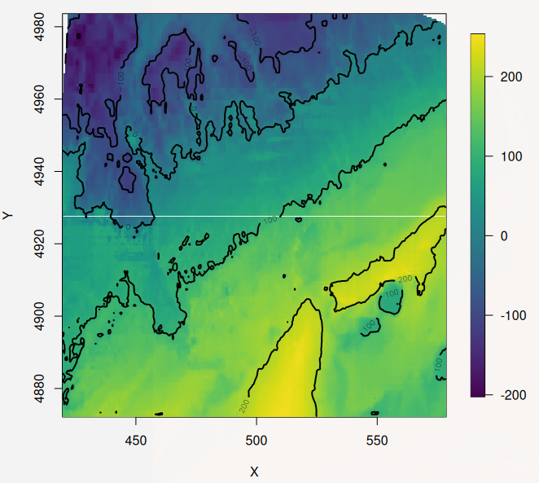
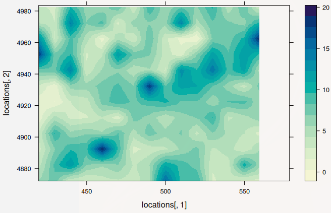

# Bathymetry modelling and prediction using STMV

Spatial interpolation using [STMV - Space-Time Models of Variability](https://github.com/jae0/stmv) involves modelling the autocorrelation function of some feature of interest. STMV comes from the tradition of *Kriging with external drift*, where external drift represents some externally imposed gradient that is first modelled and then the residuals are modelled as some spatial process. This is, therefore, slightly ad-hoc in approach in that the external forcing is treated separately (modelled via MGCV or GLM) from the random spatial processes. Improved results would be expected if Expectation-Maximization or Gibbs sampling is used. However, due to computational expenses, this was not available when constructed. This may change soon and I might update the approach, time being the constraint. 

The example here uses FFT (Fast Fourier Transforms) to discretize the spatial autocorrelation process (Matern). It is the method of choice for speed and ability to capture the variability .. this should take just a few minutes

```r
# prep data

require(aegis)
require(aegis.survey)
require(aegis.bathymetry)
require(stmv)
require(sf)

p0 = aegis::spatial_parameters( spatial_domain="bathymetry_example",
  aegis_proj4string_planar_km="+proj=utm +ellps=WGS84 +zone=20 +units=km",
  dres=1/60/4, pres=0.5, lon0=-64, lon1=-62, lat0=44, lat1=45, psignif=2 )

# p0 = stmv_test_data( "aegis.test.parameters")  # same thing

# separate data components
input = stmv::stmv_test_data( datasource="aegis.space", p=p0)
input = sf::st_as_sf( input, coords=c("lon","lat"), crs=st_crs(projection_proj4string("lonlat_wgs84")) )
input = sf::st_transform( input, crs=st_crs(p0$aegis_proj4string_planar_km) )
input = as.data.frame( cbind( input$z, st_coordinates(input) ) )
names(input) = c("z", "plon", "plat")
input = input[ which(is.finite(input$z)), ]
output = list( LOCS = spatial_grid(p0) )
DATA = list( input = input,  output = output )

input = output = NULL
gc()

# set up interpolation options
p = bathymetry_parameters(
  p=p0,  # start with spatial settings of input data
  project_class="stmv",
  stmv_model_label="fft_tapered_statsgrid10km",  # this label is used as directory for storage
  data_root = file.path(tempdir(), "bathymetry_example"),
  DATA = DATA,
  spatial_domain = p0$spatial_domain,
  spatial_domain_subareas =NULL,
  inputdata_spatial_discretization_planar_km = p0$pres,  # pres = 0.5
  dimensionality="space",
  stmv_variables = list(Y="z"),  # required as fft has no formulae
  stmv_global_modelengine = "none",  # too much data to use glm as an entry into link space ... use a direct transformation
  stmv_local_modelengine="fft",
  stmv_fft_filter = "matern tapered lowpass modelled fast_predictions", #  matern with taper, fast predictions are sufficient as data density is high
  stmv_lowpass_nu = 0.5,
  stmv_lowpass_phi = stmv::matern_distance2phi( distance=0.5, nu=0.5, cor=0.1 ),  # note: p$pres = 0.5
  stmv_variogram_method = "fft",
  stmv_autocorrelation_fft_taper = 0.9,  # benchmark from which to taper .. high data density truncate local predictions to capture heterogeneity
  stmv_autocorrelation_localrange = 0.1,
  stmv_autocorrelation_interpolation = c(0.3, 0.25, 0.1, 0.05, 0.01),  # start with smaller localrange estimates and expand
  stmv_filter_depth_m = FALSE,  # need data above sea level to get coastline
  stmv_Y_transform =list(
    transf = function(x) {log10(x + 2500)} ,
    invers = function(x) {10^(x) - 2500}
  ), # data range is from -1667 to 5467 m: make all positive valued
  stmv_rsquared_threshold = 0.01, # lower threshold  .. i.e., ignore ... there is no timeseries model, nor a fixed effect spatial "model"
  stmv_distance_statsgrid = 10, # resolution (km) of data aggregation (i.e. generation of the ** statistics ** )
  stmv_distance_scale = c( 2.5, 5, 10, 20, 40, 60, 80 ), # km ... approx guesses of 95% AC range
  stmv_distance_interpolation = c( 5, 10, 15, 20, 40, 60, 80  ) , # range of permissible predictions km (i.e 1/2 stats grid to upper limit) .. in this case 5, 10, 20
  stmv_distance_prediction_limits =c( 2.5, 10 ), # range of permissible predictions km (i.e 1/2 stats grid to upper limit based upon data density)
  stmv_nmin = 30,  # min number of data points req before attempting to model in a localized space
  stmv_nmax = 900, # no real upper bound.. just speed /RAM
  stmv_force_complete_method = "fft",
  stmv_runmode = list(
    scale =list( 
      distsc1 = rep("localhost", 1), 
      distsc2 = rep("localhost", 1), 
      distsc3 = rep("localhost", 1), 
      distsc4 = rep("localhost", 1), 
      distsc5 = rep("localhost", 1), 
      distsc6 = rep("localhost", 1), 
      distsc7 = rep("localhost", 1)
    ),
    interpolate_correlation_basis = list(
      c1 = rep("localhost", 1),
      c2 = rep("localhost", 1),
      c3 = rep("localhost", 1),
      c4 = rep("localhost", 1),
      c5 = rep("localhost", 1)
    ),
    interpolate_predictions = list(
      c1 = rep("localhost", 1),
      c2 = rep("localhost", 1),
      c3 = rep("localhost", 1),
      c4 = rep("localhost", 1),
      c5 = rep("localhost", 1),
      c6 = rep("localhost", 1),
      c7 = rep("localhost", 1) 
    ),
    globalmodel = FALSE,
    save_intermediate_results = TRUE,
    save_completed_data = TRUE
  ) 
)


if (0) {
  # to force parallel mode

    scale_ram_required_main_process = 1 # GB twostep / fft ---
    scale_ram_required_per_process  = 1 # twostep / fft /fields vario ..  (mostly 0.5 GB, but up to 5 GB)
    scale_ncpus = min( parallel::detectCores(), floor( (ram_local()- scale_ram_required_main_process) / scale_ram_required_per_process ) )

    # 5 mins
    interpolate_ram_required_main_process = 1 # GB twostep / fft
    interpolate_ram_required_per_process  = 1.5 # twostep / fft /fields vario ..
    interpolate_ncpus = min( parallel::detectCores(), floor( (ram_local()- interpolate_ram_required_main_process) / interpolate_ram_required_per_process ) )

    stmv_runmode = list(
      scale = list( 
        distsc1 = rep("localhost", scale_ncpus), 
        distsc2 = rep("localhost", scale_ncpus), 
        distsc3 = rep("localhost", scale_ncpus), 
        distsc4 = rep("localhost", scale_ncpus), 
        distsc5 = rep("localhost", scale_ncpus), 
        distsc6 = rep("localhost", scale_ncpus), 
        distsc7 = rep("localhost", scale_ncpus)
      ),
      interpolate_correlation_basis = list(
        c1 = rep("localhost", interpolate_ncpus),  # ncpus for each runmode
        c2 = rep("localhost", interpolate_ncpus),  # ncpus for each runmode
        c3 = rep("localhost", interpolate_ncpus),
        c4 = rep("localhost", interpolate_ncpus),
        c5 = rep("localhost", interpolate_ncpus)
      ),
      interpolate_predictions = list(
        c1 = rep("localhost", interpolate_ncpus),  # ncpus for each runmode
        c2 = rep("localhost", interpolate_ncpus),  # ncpus for each runmode
        c3 = rep("localhost", interpolate_ncpus),
        c4 = rep("localhost", interpolate_ncpus),
        c5 = rep("localhost", interpolate_ncpus),
        c6 = rep("localhost", interpolate_ncpus),
        c7 = rep("localhost", interpolate_ncpus)
      ),
      globalmodel = FALSE,
      # restart_load = "interpolate_correlation_basis_0.01" ,  # only needed if this is restarting from some saved instance
      save_intermediate_results = TRUE,
      save_completed_data = TRUE

    )  # ncpus for each runmode

}


# quick look of data
dev.new(); surface( as.image( Z=DATA$input$z, x=DATA$input[, c("plon", "plat")], nx=p$nplons, ny=p$nplats, na.rm=TRUE) )
```

The raw data with a fast interpolation with "surface":


We see that land, to the north-west is sparsely sampled. 

---

Now we run the model:

```r

stmv( p=p  )  # This will take from a few minutes, depending upon system
# stmv_db( p=p, DS="cleanup.all" )
```

And then some outputs:

```r

predictions = stmv_db( p=p, DS="stmv.prediction", ret="mean" )
statistics  = stmv_db( p=p, DS="stmv.stats" )
locations =  spatial_grid( p )


# comparison
dev.new(); surface( as.image( Z=predictions, x=locations, nx=p$nplons, ny=p$nplats, na.rm=TRUE) )

```



What makes STMV unique is the non-stationary assumption of the spatial process. As such, we can recover estimates of spatial parameters as a function of location!

```r
statsvars = dimnames(statistics)[[2]]

# statsvars = c("sdTotal", "ndata", "fixed_mean", "fixed_sd", "dic", "dic_p_eff",
#   "waic", "waic_p_eff", "mlik", "Expected_number_of_parameters",
#   "Stdev_of_the_number_of_parameters", "Number_of_equivalent_replicates",
#   "Precision_for_the_Gaussian_observations", "Precision_for_space",
#   "Phi_for_space", "Precision_for_the_Gaussian_observations_sd", "Precision_for_space_sd", "Phi_for_space_sd"
# )

# statsvars = c( "sdTotal", "rsquared", "ndata", "sdSpatial", "sdObs", "phi", "nu", "localrange" )
dev.new(); levelplot( predictions[] ~ locations[,1] + locations[,2], aspect="iso" )
dev.new(); levelplot( statistics[,match("nu", statsvars)]  ~ locations[,1] + locations[,2], aspect="iso" ) # nu
dev.new(); levelplot( statistics[,match("sdTotal", statsvars)]  ~ locations[,1] + locations[,2], aspect="iso" ) #sd total
dev.new(); levelplot( statistics[,match("localrange", statsvars)]  ~ locations[,1] + locations[,2], aspect="iso" ) #localrange
```

These are estimates of the spatial variability of depth as a function of space. Clearly they are spatially patterned and so non-stationary! 


Further the shape of the AC (autocorrelation) function varies with space. The Matern nu (strength of curvature of AC function) as a function of space is here.


And estimates of spatial range, the length scales at which variability of the AC-function declines to some very low level!




